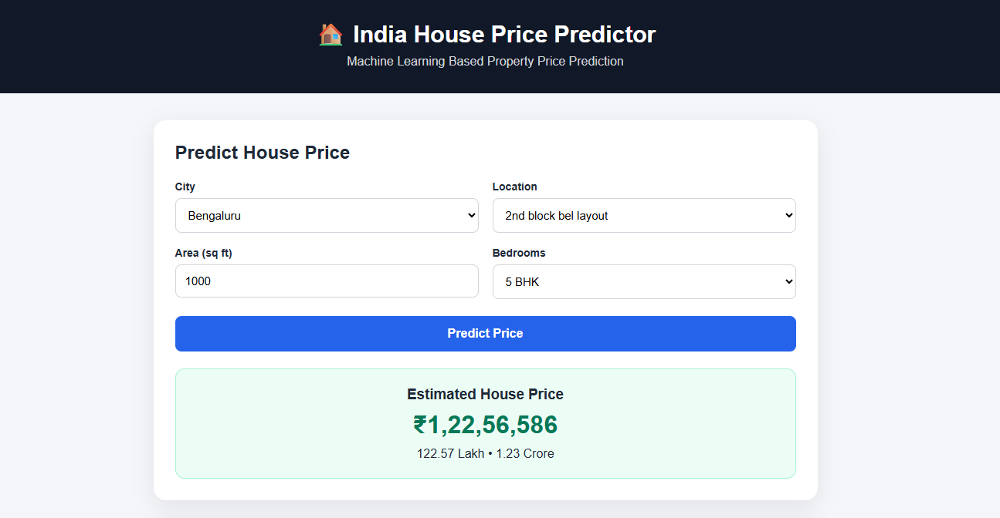

# 🏠 India House Price Predictor

A **Machine Learning-based House Price Prediction Web Application** that predicts property prices based on different property features such as city, location, area, bedrooms, bathrooms, furnishing, parking, property type, and more.

## 🖼️ Project Preview

## 🚀 Live Demo

👉 **[Try the Live Application](https://house-price-prediction-ymul.onrender.com/)**

## ✨ Features

* 🏠 House price prediction using Machine Learning
* 📍 City & location based prediction
* 📐 Area-based prediction
* 🛏️ Bedrooms & bathrooms
* 📊 Bulk prediction using CSV
* 🌐 Deployed live using Render

## 🛠️ Tech Stack

* Python
* Pandas
* NumPy
* Scikit-learn
* Machine Learning
* FastAPI
* HTML
* CSS
* Render

## 🌐 Live Project

**Live Demo:**
https://house-price-prediction-ymul.onrender.com/

---

### 📌 Project Status

✅ Model trained
✅ Web application developed
✅ GitHub repository uploaded
✅ Deployed on Render
✅ Live Demo Available
